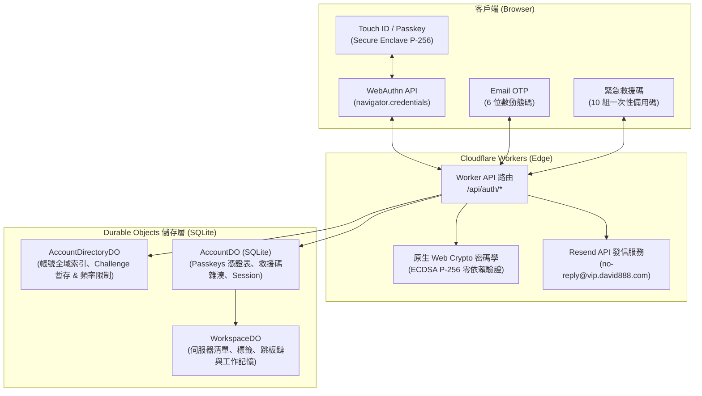

# 888CloudSSH

獨立維護的 Web SSH 工作台，部署在 Cloudflare Workers 上。

本專案由 [CloudSSH](https://github.com/newbietan/CloudSSH) 衍生而來，感謝原作者 [TanXin (@newbietan)](https://github.com/newbietan) 以及所有歷史貢獻者提供 SSH、SFTP、Cloudflare Workers 與安全架構基礎。888CloudSSH 目前獨立維護，不同步原作者倉庫。

## 功能

- 瀏覽器 SSH 終端與多工作階段分頁
- SFTP 檔案管理、批次傳輸與線上編輯
- 密碼、私鑰與 SSH `keyboard-interactive`／OTP 認證
- **無密碼安全認證體系**：
  - **Touch ID / Passkey**：基於 FIDO2 / WebAuthn 的本機生物辨識與通行密鑰秒級登入（P-256 原生 Web Crypto 驗證）
  - **Email OTP**：基於 Resend 的 6 位數一次性動態驗證碼發信與帳號白名單
  - **緊急救援碼**：10 組一次性單向雜湊（HMAC-SHA256）備用碼，支援自主查詢剩餘組數與隨時重新生成
- SSH 跳板鏈與 Cloudflare Tunnel
- GitHub OAuth、指定 GitHub 使用者白名單與匿名模式控制
- AI Agent、命令片段與伺服器工作記憶
- 主機指紋 TOFU、DNS rebinding SSRF 防護與分享會話審計
- 繁體中文、簡體中文與 English
- 預設佈景：Standard Dark

## 身分認證架構 (Authentication Architecture)

888CloudSSH 採用邊緣無伺服器多層身分防護架構，深度整合 Cloudflare Workers 與 Durable Objects：



- **日常登入 (Fast Path)**：Touch ID / Passkey，輕觸指紋 0.5 秒直接進入工作區，零等待、零外部依賴。
- **首次登入 / 換裝置 (Bootstrap)**：Email OTP 寄送驗證碼，驗證成功後可一鍵將當前裝置註冊為 Touch ID。
- **應急救護 (Fallback)**：當信箱或 Passkey 無法使用時，可使用 10 組一次性救援碼登入，並隨時重新生成。

## 部署

### Cloudflare Workers

需要 Node.js、pnpm、Wrangler 與 Cloudflare Workers 帳號。

```bash
pnpm install --frozen-lockfile
cd frontend && pnpm install --frozen-lockfile && cd ..
pnpm run build:frontend
wrangler deploy --env="" --keep-vars
```

`wrangler.toml` 的 Worker 名稱目前是 `cloudssh`。請先設定正確的 Cloudflare account ID，或在 Wrangler 設定中指定 `account_id`。

### 身分驗證環境變數 (Authentication Variables)

在 Cloudflare Workers 的 Variables and Secrets 設定：

- **Email OTP & 救援碼**：
  - `RESEND_API_KEY`：Resend 發信 API 金鑰（Secret）
  - `RESEND_FROM_EMAIL`：發件信箱，例如 `no-reply@vip.david888.com`
  - `BOOTSTRAP_OWNER_EMAIL`：首位管理員 Email，例如 `tbdavid2019@gmail.com`
  - `ALLOWED_EMAILS`：可選，逗號分隔的允許登入信箱白名單
  - `REQUIRE_AUTH=true`：強制登入模式
- **GitHub OAuth（可選）**：
  - `GITHUB_CLIENT_ID` / `GITHUB_CLIENT_SECRET`
  - `BASE_URL`
  - `GITHUB_ALLOWED_USER_IDS`（可選，逗號分隔的 GitHub 數字 ID）
  - `REQUIRE_GITHUB_AUTH=true`

## 本地開發

```bash
pnpm install --frozen-lockfile
cd frontend && pnpm install --frozen-lockfile && cd ..
pnpm run dev
```

常用檢查：

```bash
pnpm run typecheck
pnpm test
pnpm run build:frontend
pnpm run verify
```

前端語系偏好儲存在瀏覽器 `localStorage` 的 `cloudssh_locale`。沒有已存偏好時，預設使用 English；使用者切換語言後會保留選擇。

## 專案結構

```text
src/       Cloudflare Worker、Durable Objects、SSH/SFTP 協定與 Agent
frontend/  TypeScript、Vite、xterm.js 與 UI
tests/     Vitest、Playwright、SSH 與 Worker 測試
docs/      GitHub Pages 主題編輯器
```

## 變更紀錄

請參閱 [CHANGELOG.md](CHANGELOG.md)。後續紀錄使用日期，不使用版本號。

## 授權與署名

888CloudSSH 是混合授權的衍生專案：

- 原始 CloudSSH 程式碼與原作者、歷史貢獻者的部分，繼續依 [Apache License 2.0](LICENSE) 與 [NOTICE](NOTICE) 分發。
- 由 888CloudSSH 維護者新增、且可與原始部分區分的程式碼，依 [GNU AGPL-3.0-or-later](LICENSE-AGPL-3.0) 分發。
- 同時包含原始程式碼與新增修改的檔案，原始部分保留 Apache 2.0，新增加的部分適用 AGPL-3.0-or-later；兩份授權與 NOTICE 都必須保留。

原專案名稱、作者與貢獻者歸屬仍以原始倉庫與 NOTICE 為準。這份說明描述本專案的授權範圍，不取代個別檔案與第三方套件的授權條款。
