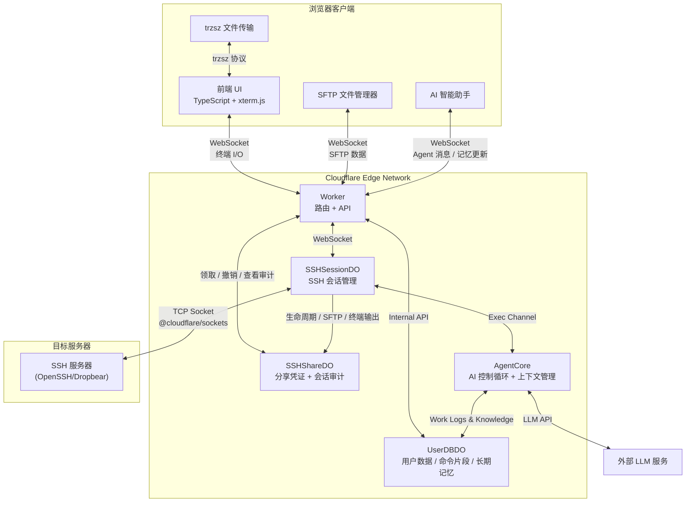

<div align="center">
  
  <p>一个基于 Cloudflare Workers 的 Serverless Web SSH 终端：通过浏览器直接连接和管理你的服务器。</p>
  <p><b>极致轻量 · 开箱即用 · 赛博朋克 UI</b></p>
  <p>
    <a href="https://github.com/newbietan/CloudSSH/stargazers"></a>
    <a href="LICENSE"></a>
    
    
    
  </p>
  <p>
    <a href="#highlights">核心优势</a> ·
    <a href="#features">功能特性</a> ·
    <a href="#quick-start">部署指南</a> ·
    <a href="#architecture">架构设计</a> ·
    <a href="CHANGELOG.md">更新日志</a> ·
    <a href="#contributors">贡献者</a> ·
    <a href="#license">开源协议</a>
  </p>
  <p>
    <a href="README.md">简体中文</a> |
    <a href="README_en.md">English</a>
  </p>
</div>

> [!TIP]
> **CloudSSH** 利用 Cloudflare Workers 的 TCP Sockets 支持，在边缘节点实现 SSH 协议的解析与转发，提供低延迟的 Web 终端体验。

## 效果演示

> 想象一下，随时随地打开浏览器，就能以极具科技感的赛博朋克 UI 连接你的服务器，无需安装任何 SSH 客户端。

<div align="center">
  <a href="https://www.bilibili.com/video/BV1UgMt6UEdF" target="_blank" title="点击播放视频">
    
    <br/>
    
  </a>
  <p><sub>视频时长 19:48 · 演示 CloudSSH 完整使用流程</sub></p>
</div>

## 目录

<details>
<summary><b>点击展开完整目录</b></summary>

- [核心优势](#highlights)
- [核心特性](#features)
- [架构说明](#architecture)
- [快速部署](#quick-start)
  - [GitHub 绑定自动部署](#推荐通过-github-绑定自动部署)
    - [自动同步上游版本](#可选自动同步上游版本)
  - [可配置环境变量](#可配置环境变量)
  - [配置 Turnstile](#可选配置-turnstile-人机验证)
  - [配置 GitHub OAuth](#可选配置-github-oauth-登录与服务器管理)
- [开发说明](#development)
  - [本地开发](#本地开发)
- [贡献者](#contributors)
- [开源协议](#license)

</details>

<a id="highlights"></a>

## 核心优势

### 极致 Serverless

- **零服务器成本**：纯前端 + Cloudflare Workers，无需自建后端服务器。
- **边缘加速**：全球边缘网络就近接入，随时随地享受低延迟的 SSH 连接。

### 开箱即用

- **一键部署**：Fork 仓库后在 Cloudflare Dashboard 绑定 GitHub 即可自动构建部署，无需本地环境。
- **现代技术栈**：TypeScript + Vite + Tailwind CSS + xterm.js，兼顾性能与可维护性。

### 安全可靠

- **双段加密**：浏览器 ↔ Worker 走 HTTPS/WSS；Worker ↔ 服务器走完整 SSH-2.0 协议（Curve25519-SHA256/ECDH-NISTP256 密钥交换、AES-256-GCM/CTR 加密、HMAC-SHA2 完整性校验）。
- **主机指纹验证**：Ed25519/ECDSA P-256/P-384/P-521/RSA 签名校验，首次连接展示 SHA-256 指纹（TOFU）。
- **多层防护**：IPv6/保留地址 SSRF + DNS 防重绑定、Worker 内存限流削峰、Turnstile 人机验证；已保存凭据在每用户 SQLite 中以 AES-256-GCM 加密存储。
- **会话隔离**：每个终端会话由独立 Durable Object 管理，活动 SSH TCP 连接使会话保持唤醒。
- **凭据内部流转**：一键连接时服务端解密凭据并经一次性令牌内部传递到会话，浏览器全程不接触明文。

<a id="features"></a>

## 核心特性

<details>
<summary><b>点击展开查看完整功能特性列表（自研 SSH 协议栈、跳板链、一次性分享、在线 SFTP、AI 运维助手等）</b></summary>

- **纯 TypeScript SSH-2.0 实现**：完全自研的 SSH 协议栈，不依赖任何第三方 SSH 库，基于 Web Crypto API 实现全部加密操作。
- **多算法密钥交换**：支持 Curve25519-SHA256（优先）和 ECDH-NISTP256 两种 KEX 算法，适配各类 SSH 服务器（包括 Dropbear）。
- **可靠的密钥切换与分包处理**：逐包读取当前加密与认证状态，兼容服务端将 `SSH_MSG_NEWKEYS` 和首个加密包合并在同一 TCP 数据块中返回的情况。
- **IPv4/IPv6 双栈**：完整支持 IPv4 和 IPv6 地址连接，包括 IPv6 方括号格式自动处理。
- **多种认证方式**：支持标准 SSH 密码认证、RFC 4256 `keyboard-interactive` 多轮交互认证，以及 OpenSSH 格式的 Ed25519、ECDSA P-256/P-384/P-521 和 RSA 私钥认证。交互认证支持密码、OTP、多字段提示与公钥后的二次验证；服务器提示会在绑定当前连接的安全对话框中展示，已保存密码仅在用户明确选择后代填。RSA 默认使用 RSA-SHA2-256/512，只有显式兼容配置才允许旧 `ssh-rsa` SHA-1。
- **SSH 跳板机/堡垒机**：登录用户可以为已保存服务器选择另一台已保存服务器作为跳板。CloudSSH 使用标准 RFC 4254 `direct-tcpip` 通道逐层建立 SSH，不依赖远端安装 `ssh`、`nc` 或 `socat`；支持最多 3 级跳转，最终目标的终端、SFTP 与 AI Agent 均复用完整加密链路。每一跳独立认证和验证路径隔离的主机指纹。
- **Cloudflare 隧道（Zero Trust Tunnel）**：支持通过 Cloudflare Tunnel（cloudflared）直连无公网 IP、无开放端口的内网服务器（HomeLab、局域网主机等），无需设置或租用跳板机。底层采用官方标准 WebSocket Carrier 架构将 SSH 二进制帧直接穿透传输，支持可选的 Cloudflare Zero Trust Service Token（Client ID / Client Secret）鉴权保护。上层自研 SSH 协议栈、TOFU 指纹、SFTP 文件系统及 AI Agent 全量无缝复用。
- **一次性 SSH 授权分享**：可选启用登录用户的服务器分享。链接只包含 256 位随机能力凭证，不携带主机、用户名、密码、私钥或跳板信息；凭证仅保存哈希、只能领取一次且具有独立的领取有效期与会话最长时间。分享会话允许终端和 SFTP，服务端强制禁用 AI Agent、OS 检测、主机指纹修改与自动重连；所有者可以实时撤销，并查看仅针对分享会话生成的生命周期、SFTP 操作与终端输出记录。
- **防范中间人攻击 (TOFU)**：首次连接自动提取服务器 Host Key（SHA-256 指纹）并显示，支持 Ed25519/ECDSA/RSA 签名验证，并在本地及 API 持久化缓存已知主机指纹以防范二次连接的欺骗风险。
- **全功能极客终端**：基于 `@xterm/xterm` 与 `@xterm/addon-webgl` 硬件加速渲染引擎，保证海量日志输出顺滑不卡顿。
- **可靠的终端剪贴板交互**：鼠标完成终端选区后自动复制，右键可直接粘贴；触摸设备点击快捷键栏的复制按钮进入选择模式，拖动选择文本后再次点击完成复制，避免依赖不稳定的长按选区，粘贴则使用独立按钮。粘贴统一经过 xterm.js 原生输入管线，仅在远端应用启用 bracketed paste 模式时发送对应控制序列，并自动规范化换行，兼容 Vim 等交互式编辑器和普通 Shell。
- **移动端终端适配**：针对手机和平板提供动态可视高度、软键盘与安全区适配、iOS 中文输入法兼容、紧凑工具栏、一次性 Ctrl/Alt、Esc/Tab/方向键/Home/End/PgUp/PgDn 等快捷键，以及移动端全屏 Agent/SFTP 面板。页面从后台返回后会主动验证 WebSocket，淘汰表面在线但已失效的连接；匿名会话使用当前内存凭据重新建立 SSH，登录用户的已保存服务器则重新申请一次性连接令牌，且只有收到 `shell_ready` 后才恢复“已连接”状态和终端输入。用户可主动尝试“全屏横屏”；浏览器不支持方向锁定时会回退为手动旋转提示，不会强制改变桌面端布局。移动系统若彻底回收网页，当前 Shell 仍无法无缝续接。
- **个性化 UI 与液态分段切换器**：Theme V4 系统提供 Standard Dark、Standard Light、Cyberpunk 以及参考 macOS 26 液态玻璃质感打造的 Liquid Glass 四款内置主题。用户空间顶栏与终端操作区升级为悬浮玻璃灵动岛与液态分段切换器（Liquid Segmented Controls），将 SFTP、自定义命令与 AI Agent 抽屉整合为单极药丸胶囊，配备双边异步物理弹簧引擎驱动的 3D 液态透镜滑块，提供丝滑的互斥展开与收起体验。V4 支持渐变/网格背景层（含读性遮罩与缓慢漂移动画）、扫描线/闪烁/辉光/噪点效果注册表、独立表面模糊与提饱和档位（`saturate(180%)` + 镜面内发光）与版式缩放，主体风格间差异显著。配套 [GitHub Pages 主题编辑器](https://newbietan.github.io/CloudSSH/)可实时调整颜色、形状、密度、字体、阴影、动效、背景层、效果及按钮/输入框/卡片/标签页样式，并预览登录页、服务器列表、终端 + SFTP 和 AI Agent 面板。主题通过 JSON 文件导入、导出、备份与分享；登录用户在应用中导入后会同步到账号并可跨浏览器恢复，匿名用户仅保存在当前浏览器。
- **SFTP 图形化文件管理**：集成完整的 SFTP v3 文件传输协议，提供图形化文件浏览器界面。工具栏支持路径面包屑分级导航（点击直达父级目录，点击空白切换绝对路径文本输入），列表支持按文件名、大小、修改时间双向排序（目录严格优先置顶）。支持一键新建空白文件并自动唤起 CodeMirror 在线编辑。支持目录浏览、文件上传/下载、新建文件夹、文件重命名与删除等操作；支持普通单选、`Cmd/Ctrl` 切换选择、`Shift` 连选、全选，以及批量下载文件和批量删除。双击文件智能处理（文本文件直接在线编辑，二进制/超大文件自动转串行下载）。内置 CodeMirror 在线编辑器，可直接编辑远端小文本文件（≤2MB，UTF-8 可编辑，GBK/GB18030 自动识别为只读），保留原文件换行符与 BOM，保存前自动检测远端修改并提示冲突确认，支持编辑器页脚自动换行动态切换与偏好持久化，常见配置（shell/YAML/JSON/Python/Markdown/HTML/CSS/Dockerfile/systemd 等）带语法高亮。基于 SSH 子系统实现，与终端会话并行运行，互不干扰，支持下载队列及上传取消。
- **原生文件传输**：集成 [trzsz.js](https://github.com/trzsz/trzsz.js)，支持 `trz`（上传）/ `tsz`（下载）命令进行文件传输，兼容 tmux 会话。还支持拖拽文件到终端窗口直接上传、目录传输及断点续传等高级功能。（需远程服务器安装 [trzsz](https://trzsz.github.io/)）
- **多语言界面**：内置简体中文、繁體中文与英文三套 UI 词条，默认使用英文；用户可通过语言按钮或 URL 参数切换，选择会保存到本地存储（`cloudssh_locale`）。
- **GitHub OAuth 集成**：支持 GitHub 登录，用户可保存和管理常用 SSH 服务器，实现一键连接；支持服务器配置一键克隆（Duplicate Server，快速复制参数并清空凭据）；服务器支持最多 10 个规范化标签，列表可按名称、主机地址、用户名即时搜索并按标签筛选，分页随设备自适应（桌面每页 9 张、平板 6 张、移动端 3 张卡片）。
- **抽屉式命令片段库与分类管理**：彻底重构为右侧滑出抽屉面板（Slide-over Drawer Panel），对齐 SFTP 面板规范，展开时终端同屏保持可见无遮挡。新增横向**分类胶囊筛选栏（Category Chips）**与表单分类建议联想（`<datalist>`），支持全分类去重聚合与组合检索；内联折叠录入表单大幅优化垂直可视空间。支持 `{{var}}` 动态参数占位符模板，执行前自动拦截并弹出参数填入对话框；支持模糊搜索、一键复制纯文本、一键填入终端或直接回车执行。片段按 `user_id` 行级隔离存储于 `UserDBDO`（名称≤50、命令≤2000、分类≤30、每用户≤100 条），匿名用户自动降级到本地 `localStorage`；桌面与移动端均可在工具栏访问，一次性分享会话中自动隐藏。
- **服务器系统自动识别**：登录用户首次连接尚未识别的已保存服务器时，CloudSSH 会在终端就绪后通过独立 SSH exec 通道读取 `/etc/os-release` 或 `uname`，并在服务器卡片显示对应系统图标。检测在后台执行，不阻塞终端；只有成功识别的结果才会保存，未识别结果会留待下次连接重新探测，修改主机地址或端口也会清除旧结果。匿名连接不执行该检测。该只读命令可能出现在目标服务器的 SSH 审计日志中。
- **IP 隐私展示与快捷复制**：服务器列表和连接状态栏会对有效 IPv4/IPv6 地址进行视觉掩码，减少演示或截图时意外暴露完整地址的风险；可通过鼠标点击或键盘操作复制用于连接的完整 IP。域名保持原样显示，视觉掩码不等同于加密或访问控制。
- **单页面多标签会话管理**：支持在单个页面内开启与切换多个独立的 SSH 终端与 SFTP 文件管理器，各会话环境和状态完全隔离，并在个性化主题编辑器中进行了联动适配。标签页支持双击内联重命名（回车保存、Esc 或空值取消复原，顶栏即时同步），并提供右键上下文菜单（重命名标签页、克隆会话开新 Tab、关闭其他标签页、关闭当前标签页）。进入服务器列表或匿名连接页后可随时通过工具栏/表单顶部按钮一键返回已建立的 SSH 会话，终端界面隐藏时也可直接按 `Esc` 快速返回；按钮随标签数量联动显隐。
- **安全匿名历史记录**：本地存储最近 5 条匿名连接，且敏感凭证可选使用本地派生的密钥进行 AES-256-GCM 安全加密存储至 `localStorage`，提供一键回填与清除。
- **双段延迟与 Colo 展示**：状态栏即时且周期性地展示当前 RTT（客户端至 Cloudflare）、物理延迟（Cloudflare 至主机）以及 Cloudflare 当前服务的数据中心代码（如 `CF-LAX`），并通过绿、黄、红三色状态点提示网络质量。
- **智能区域调度（locationHint）**：保存直连服务器时通过 IPinfo 查询主机地理信息并持久化 DO 部署区域，连接时直接读取数据库，不再执行外部地理查询；使用 SSH 跳板时仅对 Cloudflare 直接连接的最外层入口进行推断，下游内网服务器不会触发查询，其区域设置由入口统一决定。查询失败时自动退化为 Cloudflare 默认调度，也可为直连入口手动覆盖区域偏好。_注意：自动推断会把直连入口的主机信息发送给第三方 IPinfo；locationHint 是 Cloudflare 的 best-effort 特性，当目标区域 DO 容量不足时会 fallback 到最近可用区域。_
- **终端文本检索与快捷键**：支持使用快捷键 `Ctrl+Shift+F`（或 macOS 下 `Cmd+F`）呼出搜索框，实时检索终端历史日志；支持使用 `Cmd+K` (macOS) / `Ctrl+Shift+K` (Win/Linux) 一键清空屏幕与滚动历史，保留纯 `Ctrl+K` 行编辑能力不冲突。
- **终端日志一键导出**：支持通过顶栏的下载按钮，将当前活跃会话终端的完整屏幕历史 buffer 一键导出并下载为 `.txt` 文本文件，解决长日志在浏览器下鼠标选取容易卡顿的痛点。
- **AI 智能助手与运维工作备忘系统**：内置 AI Agent 侧边栏，支持 BYOK（自带 API Key）接入 OpenAI 兼容接口（如 DeepSeek、GPT-4o、Qwen、Claude 等）。配置面板采用现代化自定义 Combobox 下拉选择器（支持全量展开、即时模糊过滤、一键清空及多套内置主题自适应），支持使用已保存密钥免重复输入 Token 安全拉取模型列表，服务端实现 Base URL 强绑定防凭据外带（Credential Exfiltration）、同源 CSRF 检查与敏感信息脱敏防护。输入框上方提供快捷诊断 Prompt 气泡（Quick Prompt Chips：分析报错、系统负载、网络端口、Docker 状态），一键填充结构化排查提示词并自动聚焦输入框。内置 8 个专业运维工具（执行命令、读取终端上下文、探测环境、进程列表、systemctl 服务管理、Docker 容器管理、用户确认及结构化报告输出）。支持终端划词“询问 AI 助手”独立上下文附件、代码块一键复制及安全单行命令填入终端。支持 LLM 流式输出与思考过程容器折叠，危险操作多级安全拦截与用户确认。
  - **双轨长期记忆系统**：具备精准时间感知与用户当地时区换算（今天、昨天、N天前）。分为**工作历程（Work Log）**（滚动记录最新运维轨迹，连续排障自动承前启后合并 `update_latest`，防止刷屏碎片化）与**关键知识与凭据备忘（Context Knowledge）**（自动沉淀 Token、密码、端口、路径配置等，后续执行直接带入复用，绝不重复向用户索取；支持键值规范化与原子覆盖更新）。
  - **长短时记忆职责解耦**：会话内摘要专职跟踪当前未完结任务与决策待办，服务器长期记忆专职持久化运维轨迹与配置实体，杜绝冗余重复。
  - **内敛抽屉式交互**：提供独立「工作备忘与记忆」抽屉面板，工作历程卡片支持两行文本截断、悬停完整 Tooltip 与点击展开；机密凭据默认掩码呈现，支持一键切换明文、快捷复制与删除。
- **工程质量门禁**：GitHub Actions 在 `test` 与 `main` 分支部署前依次执行冻结锁文件安装、Worker/前端类型检查、单元与集成测试、可复现前端构建、Playwright 浏览器 E2E 和 axe 无障碍回归；任一环节失败都会阻止部署。

</details>

<a id="architecture"></a>

## 架构说明

### 系统架构



<a id="quick-start"></a>

## 快速部署

### 前置要求

- 一个 Cloudflare 账号。
- 启用 Cloudflare Workers 免费计划（TCP Sockets 和 Durable Objects 功能需要）。

### 部署步骤

#### 推荐：通过 GitHub 绑定自动部署

<div align="center">
  <a href="https://dash.cloudflare.com/?url=https://github.com/newbietan/CloudSSH">
    
  </a>
  <p>点击按钮跳转至 Cloudflare 控制台，授权 GitHub 后即可自动完成部署</p>
</div>

1. **Fork 本仓库** 到你的 GitHub 账号。
2. **创建 Worker 应用**：登录 Cloudflare，进入 Workers & Pages，点击创建应用，绑定你的 GitHub 账号，选择 Fork 的仓库。
3. **填写构建命令**：在部署设置中，将"构建命令"（Build command）填写为 `pnpm run build:frontend`，点击保存并部署。
4. **访问应用**：部署成功后，可通过默认域名 `https://cloudssh.<你的子域>.workers.dev` 访问。
5. **绑定自定义域名**（可选）：进入 Worker 的 Settings → Domains & Routes → Add，输入你的域名并确认。

> **说明**：如需部署 test 环境，可 Fork 后在 `test` 分支上重复上述步骤，创建独立的 Worker（如 `cloudssh-test`）。两个环境的 Durable Objects 数据完全隔离，各自独立。

##### 可选：自动同步上游版本

Fork 仓库可以通过内置的 `Sync upstream` GitHub Actions 工作流，定时将本项目 `main` 分支的最新版本同步到自己的 `main` 分支。该功能**默认关闭**，开启后每天北京时间 04:20 检查一次；同步产生的分支更新会由 Cloudflare Git 集成自动构建并部署，无需额外配置部署开关。

1. 确认 Cloudflare Worker 连接的是你自己的 Fork 仓库，且 Production branch 设置为 `main`，自动构建处于开启状态。
2. 进入 Fork 仓库的 **Actions** 页面并启用工作流。已有 Fork 如果尚未包含 `Sync upstream`，请先通过 GitHub 的 **Sync fork** 功能手动同步一次。
3. 进入 **Settings → Secrets and variables → Actions → Variables**，创建 Repository variable：
   - Name：`AUTO_SYNC_UPSTREAM`
   - Value：`true`
4. 如需立即同步，进入 **Actions → Sync upstream → Run workflow** 手动执行；手动执行不要求设置上述变量。

> **同步说明**：若上游工作流发生改动时，自动同步会失败，请手动完成一次仓库同步即可。

#### 可配置环境变量

所有功能与安全策略均由 Worker 环境变量控制，可在 Cloudflare Dashboard 的 **Settings → Variables and Secrets** 中按需添加（敏感凭据建议选择 **Secret** 加密类型），保存后重新部署即可生效：

| 环境变量                  | 是否必填       | 默认值       | 作用说明                                                                                               | 配置建议与注意事项                                                                                                                                                                                                                     |
| ------------------------- | -------------- | ------------ | ------------------------------------------------------------------------------------------------------ | -------------------------------------------------------------------------------------------------------------------------------------------------------------------------------------------------------------------------------------- |
| `IDLE_TIMEOUT`            | 可选           | `30m`        | 用户无操作空闲超时时长。会话超过该时间无键盘输入、SFTP 操作或 AI 任务将自动断开并释放 Durable Object。 | **强烈建议保留默认或按需配置**。防止离开电脑或忘记关闭标签页无休止消耗 Cloudflare 每日 13,000 GB-s 免费额度。支持 `30m`、`1h`、`1800s`、`1800`（纯数字按秒解析）；设为 `0` 可禁用；超时前 60s 会在终端输出预警，敲击任意键可一秒续期。 |
| `GITHUB_CLIENT_ID`        | 启用登录时必填 | 无           | GitHub OAuth 应用的 Client ID，用于开启多用户登录与已保存服务器/命令片段云端管理。                     | 公开 ID。需与 `GITHUB_CLIENT_SECRET` 和 `BASE_URL` 配合使用。未配置时整个登录入口自动隐藏，不影响匿名 SSH 连接。                                                                                                                       |
| `GITHUB_CLIENT_SECRET`    | 启用登录时必填 | 无           | GitHub OAuth 应用的 Client Secret，用于服务端向 GitHub 安全换取用户访问令牌。                          | **敏感凭据，务必在 Cloudflare Dashboard 中设为 Secret 类型**。严禁泄露或直接提交到公共代码仓库。                                                                                                                                       |
| `BASE_URL`                | 启用登录时必填 | 无           | 部署站点的完整公网访问根地址（如 `https://ssh.example.com`），用于生成 OAuth 授权回调跳转。            | 域名必须与 GitHub OAuth App 中的 Authorization callback URL 完全一致，末尾**不要**加斜杠 `/`。未配置时降级使用请求上下文 Host。                                                                                                        |
| `GITHUB_ALLOWED_USER_IDS` | 可选           | 无（不限制） | 允许登录系统的 GitHub **数字用户 ID** 白名单列表，多个 ID 以英文逗号分隔（如 `83105156,6236783`）。    | **私有化部署核心防线**。未配置时任何 GitHub 用户均可登录；一旦配置，仅白名单用户允许登录（fail-closed 机制）。数字 ID 可访问 `https://api.github.com/users/<username>` 查看 `id` 字段获取。                                            |
| `REQUIRE_GITHUB_AUTH`     | 可选           | `false`      | 是否强制 GitHub 登录后才可使用 SSH 终端。设为 `true` 时彻底禁用匿名直连入口。                          | **公网部署防被蹭推荐开启**。若不希望未授权访客将你的 Worker 用作公开 SSH 代理节点，建议配置为 `true` 并配合白名单使用。                                                                                                                |
| `TURNSTILE_SITEKEY`       | 可选           | 无           | Cloudflare Turnstile 人机验证的前端公开 Site Key。                                                     | 公开密钥。与 `TURNSTILE_SECRET` 配合使用，在未配置或配置任一为空时人机验证功能自动禁用。                                                                                                                                               |
| `TURNSTILE_SECRET`        | 可选           | 无           | Cloudflare Turnstile 人机验证的服务端 Secret Key，用于校验前端回传的人机验证 Token。                   | **敏感密钥，建议保存为 Secret 类型**。开启后可有效拦截自动化扫描脚本、批量机器人和恶意滥用。                                                                                                                                           |
| `ENABLE_SSH_SHARING`      | 可选           | `false`      | 是否开启一次性受控 SSH 分享功能。设为 `true` 时登录用户可为已保存服务器生成临时受控分享链接。          | 生产环境按需开启。分享链路仅支持受限终端与可选 SFTP，受完整操作审计记录监督，禁止使用 AI Agent、修改服务器元数据或跨网络重连。                                                                                                         |
| `STRICT_HOST_KEY_VERIFY`  | 可选           | `true`       | SSH 远端主机公钥签名严格校验开关。默认 `true`（fail-closed，签名不合法或算法不支持时立即终止握手）。   | **生产环境务必保持默认 `true`**。仅在本地调试、测试自签或老旧不兼容服务器且明确知晓安全风险时才允许设为 `false`。                                                                                                                      |
| `DEBUG_MODE`              | 可选           | `false`      | 详细调试模式开关。设为 `true` 时在 API 响应和前端终端中输出底层协议握手与诊断日志。                    | `wrangler.toml` 默认声明为 `false`。仅在排查连接握手故障时临时开启，生产环境日常运行建议保持 `false`。                                                                                                                                 |

> **配置建议与补充说明**：
>
> 1. **Secret 安全存储**：在 Cloudflare Dashboard 的 _Settings → Variables and Secrets_ 中，强烈建议将所有包含密码、Secret、Key 等敏感凭据的变量统一选择为 **Secret** 类型。Secrets 存储在 Cloudflare 独立加密存储层中，重新构建和部署 Worker 时不会被代码覆盖。
> 2. **预留变量说明**：代码中保留了 `MAX_CONNECTIONS` 环境变量接口定义，当前版本暂未读取生效，请勿依赖。

> **说明**：如需本地命令行部署或调试 Worker，请参考 [开发说明](#development) 中的本地开发部分。

#### 可选：配置 Turnstile 人机验证

为防止恶意机器人滥用，建议启用 Cloudflare Turnstile 验证：

1. **创建 Turnstile Widget**：登录 [Cloudflare Dashboard](https://dash.cloudflare.com/)，进入 Turnstile 页面创建一个新的 Widget。
2. **获取密钥**：创建后会获得一个 **Site Key**（公开）和一个 **Secret Key**（保密）。
3. **配置环境变量**：在 Cloudflare Dashboard 的 Workers 设置中，进入 "Settings" → "Variables and Secrets"，添加以下环境变量：
   - `TURNSTILE_SECRET` = 你的 Secret Key
   - `TURNSTILE_SITEKEY` = 你的 Site Key
4. **重新部署**：运行部署命令使配置生效。

#### 可选：配置 GitHub OAuth 登录与服务器管理

启用 GitHub 登录后，用户可以通过 GitHub 账号登录，并在个人空间中保存和管理常用的 SSH 服务器，实现一键连接。不配置时，此功能自动隐藏，不影响匿名 SSH 连接的正常使用。

1. **创建 GitHub OAuth App**：
   - 登录 GitHub → Settings → Developer settings → OAuth Apps → [New OAuth App](https://github.com/settings/applications/new)
   - **Application name**：`CloudSSH`（自定义）
   - **Homepage URL**：`https://your-domain.com`（你的部署域名）
   - **Authorization callback URL**：`https://your-domain.com/api/auth/callback`
   - 创建后获得 **Client ID**，点击 **Generate a new client secret** 生成 **Client Secret**（仅显示一次，请立即保存）

2. **配置环境变量**：在 Cloudflare Dashboard 的 Workers 设置中，进入 "Settings" → "Variables and Secrets"，添加以下环境变量：
   - `GITHUB_CLIENT_ID` = 你的 Client ID
   - `BASE_URL` = `https://your-domain.com`（你的部署域名）
   - `GITHUB_CLIENT_SECRET` = 你的 Client Secret

   还可以按部署用途添加以下两个独立的可选配置：
   - `GITHUB_ALLOWED_USER_IDS`：允许登录的 GitHub **数字用户 ID**，多个 ID 使用英文逗号分隔，例如 `83105156,6236783`。未配置时不限制 GitHub 账号；配置为空或包含非正整数时采用 fail-closed，拒绝所有 GitHub 登录。
   - `REQUIRE_GITHUB_AUTH`：设置为 `true` 时禁用匿名 SSH，所有 SSH WebSocket 都必须带有有效 GitHub session；未配置或设置为 `false` 时保留匿名连接。
   - `ENABLE_SSH_SHARING`：设置为 `true` 时允许登录用户为已保存服务器创建一次性分享链接；默认关闭。启用即表示管理员明确允许持有分享凭证的接收者在不登录 GitHub 的情况下建立受审计 SSH 会话。

   **获取 GitHub 数字用户 ID**：
   - 浏览器访问 `https://api.github.com/users/octocat`（将 `octocat` 替换为实际用户名），在返回的 JSON 中读取 `id` 字段。例如响应中的 `"id": 583231` 表示数字用户 ID 为 `583231`。
   - 或在命令行执行：

     ```bash
     curl -s https://api.github.com/users/octocat | jq '.id'
     ```

   请填写 `id`，不要填写用户名或 `node_id`。数字 ID 不会随用户名修改而变化；多个账号的 ID 使用英文逗号分隔。

| 配置组合                          | GitHub 登录      | 匿名 SSH             |
| --------------------------------- | ---------------- | -------------------- |
| 两项都不配置                      | 所有 GitHub 用户 | 允许                 |
| 仅配置 `GITHUB_ALLOWED_USER_IDS`  | 仅白名单用户     | 允许                 |
| 仅配置 `REQUIRE_GITHUB_AUTH=true` | 所有 GitHub 用户 | 禁止                 |
| 两项同时配置                      | 仅白名单用户     | 禁止（私有实例模式） |

1. **重新部署**：保存环境变量后重新部署当前 Worker。仓库中的 Durable Object migration 会负责初始化所需类和数据库，不需要删除已有 Worker。

> **访问策略说明**：修改 `GITHUB_ALLOWED_USER_IDS` 后，已签发 session 会在下一次请求时重新检查并立即失效；已建立的 SSH WebSocket 不会被主动中断。`REQUIRE_GITHUB_AUTH=true` 依赖 GitHub OAuth，请同时正确配置 Client ID、Client Secret 和 `BASE_URL`。

##### 使用一次性 SSH 分享

1. 配置 GitHub OAuth，并在 Worker 环境变量中设置 `ENABLE_SSH_SHARING=true` 后重新部署。
2. 所有者先通过普通连接成功连接目标服务器及全部跳板节点，使路径范围内的主机指纹完成验证。
3. 在服务器卡片点击分享按钮，选择链接领取有效期（5/15/30/60 分钟）和会话最长时间（15/30/60/120 分钟）。
4. 创建后立即复制链接并通过可信渠道发送。CloudSSH 不保存明文分享凭证，关闭创建结果后无法再次查看同一链接。
5. 接收者打开链接，确认终端输出和 SFTP 操作会被记录后领取授权。链接只能成功领取一次；刷新、断开或关闭页面后不能重新连接。
6. 所有者可再次打开服务器的分享管理，查看状态及审计记录，或撤销待领取/活动分享。撤销活动分享会同时关闭终端和 SFTP。

> [!WARNING]
> 分享凭证虽然不包含 SSH 隐私数据，但其持有者可使用所有者保存的凭据获得完整 Shell 和 SFTP 权限，应按临时密码保护。分享只允许已有可信主机指纹的连接链，遇到指纹变化或 `keyboard-interactive`/MFA 挑战时会终止。审计记录保存服务端返回的 PTY 输出而不保存原始键盘输入，因此通常能看到 Shell 回显的命令，但不能保证捕获关闭回显、脚本内部或经编码执行的所有命令；不要将其描述为目标机级强审计。单次记录上限为 5 MiB，达到上限或审计写入失败时会关闭分享会话。

##### 使用 SSH 跳板服务器

SSH 跳转不需要额外环境变量，但必须启用 GitHub OAuth 并使用已保存服务器：

1. 先保存最外层可由 Cloudflare 直接访问的公网跳板服务器 A。
2. 再保存目标服务器 B，在“跳板服务器”中选择 A；B 可以填写只能从 A 访问的内网地址。
3. 如需多级路径，例如 C → A → B，可先把 A 的跳板设置为 C，再让 B 选择 A。系统会递归解析路径，最多允许 3 台跳板服务器。
4. 从服务器列表连接 B。终端、SFTP 和 AI Agent 只在最终目标 B 上运行；任意一跳断开时会重建或关闭整条链路。

跳板关系必须位于同一 GitHub 用户空间，不能形成自引用或循环。正在被其他服务器引用的跳板不能直接删除。SSRF 公网检查与 Durable Object 区域调度均以 Cloudflare 直接连接的最外层入口为准；只有该入口会执行自动区域推断，选择跳板后下游服务器的区域选项会停用，也不会向 IPinfo 发送其内网主机信息。内网地址只能出现在由服务端解析的已保存跳板链中，匿名连接不能提交跳板配置。每一跳都会独立执行 TOFU 主机指纹验证，内网目标的记录按完整跳转路径隔离。

##### 通过 Cloudflare 隧道连接内网服务器

在添加/编辑服务器时，选择**“Cloudflare 隧道”**连接模式，可直接穿透连接无公网 IP、无开放端口的私有内网服务器（如家庭宽带 NAS、局域网机器、私有开发机），免除端口映射或跳板机配置：

1. **内网服务器配置 cloudflared**：在内网服务器运行 Cloudflare Tunnel，将配置好的公开主机名指向本地 SSH 端口（例如 `service: ssh://localhost:22`）。
2. **在 CloudSSH 添加服务器**：
   - **网络连接**：切换到「Cloudflare 隧道」分段；
   - **隧道域名**：填入在 Cloudflare Zero Trust 中配置的公开主机名（例如 `ssh.example.com`）；
   - **连接区域**：建议根据内网主机的实际物理位置手动选择最近的区域（如亚洲内网选 `亚太地区`），促使 Durable Object 就近实例化，避免跨洋三角路由延迟；
   - **Zero Trust 访问凭据 (可选)**：若在 Zero Trust 中为该域名开启了 Access 策略，需填入 Service Token 的 Client ID 与 Client Secret；若后续不再需要，支持一键清除已存密钥。
3. **连接与体验**：连接成功后状态栏会呈现 `CF-XXX`（Cloudflare 到内网隧道握手耗时）与 `RTT`（浏览器到 Cloudflare 边缘耗时）双段延迟，SSH 终端、SFTP 在线编辑与 AI Agent 全量无缝复用。

<a id="development"></a>

## 开发说明

### 项目结构

本项目采用 pnpm monorepo 工作区结构：

```
CloudSSH/
├── src/                    # 后端源码 (Cloudflare Worker)
│   ├── ssh/                # SSH 协议纯实现层（传输、加密、认证、通道、SFTP）
│   └── worker/             # Worker 入口和 Durable Objects
│       ├── agent/          # AI Agent 控制循环、工具、安全检测
│       ├── dns-check.ts    # DNS 防重绑定 SSRF 防护
│       ├── ip-geo.ts       # IPinfo 区域推断 → locationHint
│       ├── share-audit-writer.ts # 分享审计事件写入、防抖与并发控制
│       ├── ssh-interactive-auth.ts # 键盘交互认证独立状态机
│       └── ssh-detached-buffer.ts   # 弱网断线保持 128KB 缓冲队列
├── frontend/               # 前端源码 (独立 workspace)
│   └── src/                # TypeScript + xterm.js + trzsz
│       ├── agent/          # AI 助手侧边栏 UI
│       ├── i18n/           # 中、繁中、英文词条与语言解析
│       ├── sftp-editor-session.ts # SFTP 在线编辑协调器
│       ├── sftp-helpers.ts        # SFTP 面包屑解析与多维排序
│       └── snippet-variables.ts   # 命令片段参数占位符提取与替换
├── docs/                   # GitHub Pages 静态资源
│   └── theme-editor/       # 可视化主题编辑器
├── scripts/                # 构建脚本
├── tests/                  # Vitest 单元/集成 + Playwright E2E 与 axe 回归（build/ e2e/ ssh/ worker/）
├── .github/workflows/      # CI/CD 自动部署配置（deploy / github-pages / sync-upstream）
├── biome.json              # 代码格式与 lint 约定
├── playwright.config.ts    # 浏览器 E2E 测试配置
├── pnpm-workspace.yaml     # pnpm 工作区配置
└── wrangler.toml           # Cloudflare 部署配置
```

### 本地开发

<details>
<summary><b>点击展开本地开发指南（环境准备、启动开发服务器、常用命令、提交规范）</b></summary>

#### 环境准备

1. **Fork 并克隆仓库**

   ```bash
   git clone https://github.com/<你的用户名>/CloudSSH.git
   cd CloudSSH
   ```

2. **安装依赖**（需分别安装根目录和前端依赖）

   ```bash
   pnpm install
   cd frontend && pnpm install
   ```

3. **登录 Cloudflare**（首次需要，后续会缓存凭据）

   ```bash
   npx wrangler login
   ```

   > **说明**：本地开发使用 Wrangler Dev 时，会连接到你的 Cloudflare 账号以使用 Durable Objects 和 TCP Sockets。SSH 连接的真实 TCP 流量会通过 Cloudflare 的基础设施转发。

4. **配置 GitHub Actions**（可选，如需自动部署）

   如果你希望通过 GitHub Actions 自动部署到自己的 Cloudflare 账号，需要修改 `.github/workflows/deploy.yml` 中的仓库所有者名称：

   ```yaml
   if: github.repository_owner == '你的GitHub用户名'
   ```

   同时在仓库的 Settings → Secrets and variables → Actions 中配置以下 Secrets：
   - `CLOUDFLARE_API_TOKEN`：Cloudflare API Token
   - `CLOUDFLARE_ACCOUNT_ID`：Cloudflare 账号 ID

#### 启动开发服务器

```bash
pnpm run dev
```

此命令将构建前端并启动 Wrangler 本地开发环境，支持：

- 前端代码变更自动重新构建
- Worker 代码变更自动重新加载
- 完整的 Durable Objects 和 TCP Sockets 功能

开发服务器启动后，访问终端输出的本地地址（通常为 `http://localhost:8787`）即可进行调试。

#### 常用开发命令

| 命令                      | 说明                                         |
| ------------------------- | -------------------------------------------- |
| `pnpm run dev`            | 构建前端 + 启动 Wrangler 开发服务器          |
| `pnpm run build:frontend` | 仅构建前端（输出到 `frontend/dist/`）        |
| `pnpm run typecheck`      | 检查 Worker 与前端 TypeScript 类型           |
| `pnpm test`               | 运行 Vitest 单元与集成测试                   |
| `pnpm run test:e2e`       | 运行 Playwright 浏览器 E2E 与 axe 无障碍测试 |
| `pnpm run verify`         | 依次执行类型检查、测试、生产构建和浏览器 E2E |
| `pnpm run deploy:test`    | 构建并部署到隔离的测试环境                   |

#### 提交变更的流程

**禁止创建特性分支（feature branch）。** 所有变更必须直接提交到 `test` 分支，保持仓库分支结构整洁。

```
test 分支（开发/测试）  ──合并──>  main 分支（生产）
```

1. 切换到 `test` 分支：`git checkout test`
2. 拉取最新代码：`git pull origin test`
3. 进行开发并本地测试
4. 直接提交并推送：`git push origin test`
5. 测试通过后，维护者会将 `test` 分支合并到 `main` 分支

> **说明**：`main` 分支设置了保护规则，禁止直接推送。所有变更必须先提交到 `test` 分支进行测试。请勿创建 `feat/xxx`、`fix/xxx` 等特性分支，直接在 `test` 分支上提交即可。

</details>

<a id="contributors"></a>

## 贡献者

感谢以下贡献者对 CloudSSH 的代码、兼容性和用户体验所做的贡献：

| 贡献者                                               | 主要贡献                                                                                                                 |
| ---------------------------------------------------- | ------------------------------------------------------------------------------------------------------------------------ |
| [TanXin (@newbietan)](https://github.com/newbietan)  | 项目发起与持续维护；Cloudflare Serverless、SSH/SFTP、AI Agent、安全体系、主题系统及工程化建设                            |
| [David xu (@xqdoo00o)](https://github.com/xqdoo00o)  | Dropbear 兼容、trzsz 文件传输迁移、PTY 尺寸处理，以及会话退出与重连交互优化                                              |
| [vonl1 (@vonl1)](https://github.com/vonl1)           | 终端选区自动复制、兼容 Vim 的右键粘贴体验、服务器 IPv4/IPv6 掩码与完整地址快捷复制，以及服务器操作系统自动识别与品牌图标 |
| [Leon Xu (@xuthuslei)](https://github.com/xuthuslei) | 修复 `SSH_MSG_NEWKEYS` 与首个加密包同批到达时的加密状态切换和数据包解析兼容问题；修复 v1.11.0 跳板认证时序回归（#108）   |

名单及贡献说明依据 Git 提交历史与已接收的 Pull Request 整理；同一贡献者在历史中可能使用过不同的 Git 作者名称或邮箱。完整记录请参阅 [GitHub Contributors](https://github.com/newbietan/CloudSSH/graphs/contributors)。欢迎通过 Issue 和 Pull Request 参与项目建设。

<a id="license"></a>

## 开源协议

本项目基于 [Apache License 2.0](LICENSE) 协议开源。

**原作者与署名要求**：CloudSSH 由 [TanXin (@newbietan)](https://github.com/newbietan) 发起并完成核心架构设计，目前仍由原作者持续维护。任何基于本项目的二次修改、衍生开发或再发布，均须保留 [LICENSE](LICENSE) 与 [NOTICE](NOTICE) 中的许可证、版权和归属声明，并明确注明原作者及原项目链接。

商业使用、修改与再分发均以 [Apache License 2.0](LICENSE) 的条款为准；上述署名要求用于保留原项目来源和作者归属，不限制该许可证授予的其他权利。

欢迎提交 Issue 和 Pull Request 共建社区。如果这个项目对你有帮助，恳求大家给本项目点个 ⭐ Star 支持一下，非常感谢！

## Star History

<a href="https://www.star-history.com/?repos=newbietan%2FCloudSSH&type=date&legend=top-left">
 <picture>
   <source media="(prefers-color-scheme: dark)" srcset="https://api.star-history.com/chart?repos=newbietan/CloudSSH&type=date&theme=dark&legend=top-left&sealed_token=W6EXioqdcb2BEJNCLBVZIvRGDUYCaxki-xY1FfDVex2S8hS-ABAc84mDRxLIx0wQLFCd3Wh_p-t4bD4yT_iPkhi0_7Aciixag0Vj0_Qsqv3Wh_pbiD6Ykw" />
   <source media="(prefers-color-scheme: light)" srcset="https://api.star-history.com/chart?repos=newbietan/CloudSSH&type=date&legend=top-left&sealed_token=W6EXioqdcb2BEJNCLBVZIvRGDUYCaxki-xY1FfDVex2S8hS-ABAc84mDRxLIx0wQLFCd3Wh_p-t4bD4yT_iPkhi0_7Aciixag0Vj0_Qsqv3Wh_pbiD6Ykw" />
   
 </picture>
</a>
